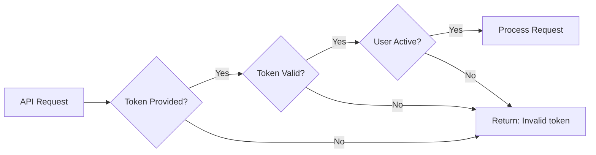

# Authentication

WNCMS API uses configurable authentication methods to secure API endpoints. This guide explains how to authenticate your API requests.

## Authentication Methods

WNCMS supports multiple authentication modes that can be configured per endpoint:

| Mode       | Description                | Use Case                 |
| ---------- | -------------------------- | ------------------------ |
| **None**   | No authentication required | Public endpoints         |
| **Simple** | API token authentication   | Most common, recommended |
| **Basic**  | HTTP Basic Authentication  | Legacy systems           |

## Simple Authentication (Recommended)

The most common authentication method using API tokens.

### Generating an API Token

1. Log in to your WNCMS admin panel
2. Navigate to your user profile
3. Find the "API Token" section
4. Click "Generate Token" or copy existing token
5. Store the token securely

### Using the API Token

Include your API token in the request body:

```json
{
  "api_token": "your-api-token-here",
  "other_parameters": "..."
}
```

### Example Request

```bash
curl -X POST "https://your-domain.com/api/v1/posts" \
  -H "Content-Type: application/json" \
  -d '{
    "api_token": "abc123def456ghi789jkl012mno345pqr678stu",
    "page_size": 10
  }'
```

### JavaScript Example

```javascript
const response = await fetch('https://your-domain.com/api/v1/posts', {
  method: 'POST',
  headers: {
    'Content-Type': 'application/json',
  },
  body: JSON.stringify({
    api_token: 'your-api-token-here',
    page_size: 10,
  }),
})

const result = await response.json()
```

## Token Security

:::warning Security Best Practices

- **Never** commit tokens to version control
- **Never** expose tokens in client-side JavaScript
- **Always** use HTTPS to protect tokens in transit
- **Rotate** tokens periodically
- **Revoke** tokens immediately if compromised
  :::

### Environment Variables

Store tokens in environment variables:

#### Node.js (.env)

```bash
WNCMS_API_TOKEN=your-api-token-here
WNCMS_API_URL=https://your-domain.com
```

```javascript
const apiToken = process.env.WNCMS_API_TOKEN
const apiUrl = process.env.WNCMS_API_URL
```

#### PHP (.env)

```bash
WNCMS_API_TOKEN=your-api-token-here
```

```php
$apiToken = env('WNCMS_API_TOKEN');
```

#### Python (.env)

```python
import os
from dotenv import load_dotenv

load_dotenv()
api_token = os.getenv('WNCMS_API_TOKEN')
```

### Token Storage Best Practices

1. **Server-Side Only**: Keep tokens on the server, not in browser
2. **Encrypted Storage**: Use encryption for database storage
3. **Limited Scope**: Create separate tokens for different applications
4. **Expiration**: Implement token expiration policies
5. **Audit Log**: Track token usage and suspicious activity

## Authentication Flow

### 1. Token Validation

When a request is received:



### 2. User Authentication

The API automatically authenticates the user associated with the token:

```php
// Behind the scenes
$user = User::where('api_token', $request->api_token)->first();

if ($user) {
    auth()->login($user);
    // User is now authenticated
}
```

## Per-Endpoint Configuration

Each endpoint can have its own authentication settings configured via WNCMS global settings.

### Feature Toggles

Endpoints can be enabled/disabled:

```php
// Example settings
'wncms_api_posts_index' => true,      // Enabled
'wncms_api_posts_store' => true,      // Enabled
'wncms_api_posts_delete' => false,    // Disabled
```

### Authentication Requirements

Some endpoints may require specific permissions:

```php
// Admin-only endpoint example
if (!$user->hasRole('admin')) {
    return response()->json([
        'status' => 'fail',
        'message' => 'Admin access required'
    ], 403);
}
```

## Common Authentication Scenarios

### Scenario 1: Public Read, Authenticated Write

```javascript
// Reading posts - no auth required (if configured)
const posts = await fetch('/api/v1/posts', {
  method: 'GET',
})

// Creating posts - auth required
const newPost = await fetch('/api/v1/posts/store', {
  method: 'POST',
  body: JSON.stringify({
    api_token: 'your-token',
    title: 'New Post',
    content: 'Content here',
  }),
})
```

### Scenario 2: Different Tokens for Different Apps

```javascript
// Mobile app token
const mobileToken = process.env.MOBILE_API_TOKEN

// Web app token
const webToken = process.env.WEB_API_TOKEN

// Admin dashboard token
const adminToken = process.env.ADMIN_API_TOKEN
```

### Scenario 3: Token Rotation

```javascript
async function rotateToken(currentToken) {
  // 1. Generate new token via admin panel
  const newToken = await generateNewToken()

  // 2. Update environment variable
  process.env.WNCMS_API_TOKEN = newToken

  // 3. Revoke old token
  await revokeToken(currentToken)

  return newToken
}
```

## Error Responses

### Invalid Token

```json
{
  "status": "fail",
  "message": "Invalid token"
}
```

**Causes:**

- Token is incorrect
- Token has been revoked
- User account is disabled

**Solutions:**

1. Verify token is correct
2. Regenerate token from admin panel
3. Check user account status

### API Disabled

```json
{
  "status": 403,
  "message": "API access is disabled"
}
```

**Causes:**

- API endpoint is disabled in settings
- Global API access is turned off

**Solutions:**

1. Enable the specific endpoint in WNCMS settings
2. Contact system administrator
3. Check global API configuration

### Admin Required

```json
{
  "status": "fail",
  "message": "Admin access required"
}
```

**Causes:**

- Endpoint requires admin role
- Current user is not an admin

**Solutions:**

1. Use an admin user's API token
2. Request admin privileges from administrator

## Multi-User Scenarios

### Multiple Users

Each user should have their own API token:

```javascript
// User 1 token
const user1Token = 'token_for_user_1'

// User 2 token
const user2Token = 'token_for_user_2'

// Use appropriate token based on context
const token = currentUserId === 1 ? user1Token : user2Token
```

### Service Accounts

Create dedicated users for API integrations:

1. Create a new user account in WNCMS
2. Assign appropriate role (e.g., "API User")
3. Generate API token for this user
4. Use this token for your integration

**Benefits:**

- Better audit trail
- Can revoke access without affecting other users
- Assign specific permissions

## Testing Authentication

### Test Token Validity

```javascript
async function testToken(apiToken) {
  try {
    const response = await fetch('https://your-domain.com/api/v1/posts', {
      method: 'POST',
      headers: {
        'Content-Type': 'application/json',
      },
      body: JSON.stringify({
        api_token: apiToken,
        page_size: 1,
      }),
    })

    const result = await response.json()

    if (result.status === 'success') {
      console.log('✓ Token is valid')
      return true
    } else if (result.message === 'Invalid token') {
      console.log('✗ Token is invalid')
      return false
    } else {
      console.log('⚠ Token valid but endpoint disabled')
      return true // Token is valid, just endpoint disabled
    }
  } catch (error) {
    console.error('Network error:', error)
    return false
  }
}

// Usage
const isValid = await testToken('your-api-token')
```

### Automated Token Validation

```javascript
class TokenValidator {
  constructor(apiUrl, apiToken) {
    this.apiUrl = apiUrl
    this.apiToken = apiToken
    this.isValid = null
    this.lastChecked = null
  }

  async validate() {
    const response = await fetch(`${this.apiUrl}/api/v1/posts`, {
      method: 'POST',
      headers: {
        'Content-Type': 'application/json',
      },
      body: JSON.stringify({
        api_token: this.apiToken,
        page_size: 1,
      }),
    })

    const result = await response.json()
    this.isValid = result.status === 'success' || result.status !== 'fail'
    this.lastChecked = new Date()

    return this.isValid
  }

  async ensureValid() {
    // Check once per hour
    if (!this.lastChecked || Date.now() - this.lastChecked > 3600000) {
      await this.validate()
    }

    if (!this.isValid) {
      throw new Error('API token is invalid')
    }

    return true
  }
}

// Usage
const validator = new TokenValidator('https://your-domain.com', 'your-api-token')

await validator.ensureValid() // Validates before proceeding
```

## Best Practices

### 1. Use HTTPS Always

```javascript
// ✓ Correct
const apiUrl = 'https://your-domain.com/api/v1/posts'

// ✗ Wrong - exposes token
const apiUrl = 'http://your-domain.com/api/v1/posts'
```

### 2. Don't Log Tokens

```javascript
// ✓ Correct
console.log('Making API request')

// ✗ Wrong - logs sensitive data
console.log('Token:', apiToken)
```

### 3. Handle Token in Headers (Server-Side)

For server-side applications, you can implement custom middleware to accept tokens in headers:

```javascript
// Custom implementation (not built-in)
const response = await fetch(url, {
  headers: {
    Authorization: `Bearer ${apiToken}`,
  },
})
```

### 4. Implement Token Refresh

```javascript
class ApiClient {
  constructor() {
    this.token = process.env.API_TOKEN
    this.tokenExpiry = null
  }

  async refreshToken() {
    // Implement your token refresh logic
    // This is application-specific
    this.token = await getNewToken()
    this.tokenExpiry = Date.now() + 24 * 60 * 60 * 1000 // 24 hours
  }

  async request(endpoint, data) {
    if (this.tokenExpiry && Date.now() > this.tokenExpiry) {
      await this.refreshToken()
    }

    return fetch(endpoint, {
      method: 'POST',
      body: JSON.stringify({
        api_token: this.token,
        ...data,
      }),
    })
  }
}
```

### 5. Rate Limit Requests

```javascript
class RateLimitedClient {
  constructor(apiToken, maxRequestsPerMinute = 60) {
    this.apiToken = apiToken
    this.maxRequests = maxRequestsPerMinute
    this.requests = []
  }

  async throttle() {
    const now = Date.now()
    this.requests = this.requests.filter((time) => now - time < 60000)

    if (this.requests.length >= this.maxRequests) {
      const waitTime = 60000 - (now - this.requests[0])
      await new Promise((resolve) => setTimeout(resolve, waitTime))
    }

    this.requests.push(now)
  }

  async request(url, data) {
    await this.throttle()

    return fetch(url, {
      method: 'POST',
      body: JSON.stringify({
        api_token: this.apiToken,
        ...data,
      }),
    })
  }
}
```

## Troubleshooting

### Token Not Working After Regeneration

**Problem:** New token returns "Invalid token"

**Solutions:**

1. Clear application cache
2. Wait a few seconds for propagation
3. Verify you copied the entire token
4. Check for whitespace in token string

### Random Authentication Failures

**Problem:** Token works sometimes, fails other times

**Solutions:**

1. Check if multiple servers are load-balanced
2. Verify database replication is working
3. Look for caching issues
4. Check server time synchronization

### Cannot Generate Token

**Problem:** "Generate Token" button doesn't work

**Solutions:**

1. Check user permissions
2. Verify admin panel access
3. Check browser console for JavaScript errors
4. Contact system administrator

## Related Documentation

- [Getting Started](./getting-started.md) - First API call with authentication
- [Core Concepts](./core-concepts.md) - Understanding API responses
- [Error Reference](./errors.md) - Authentication error codes
- [Troubleshooting](./troubleshooting.md) - Common authentication issues

## Security Checklist

Before deploying to production:

- [ ] API tokens stored in environment variables
- [ ] All API calls use HTTPS
- [ ] Tokens not exposed in client-side code
- [ ] Tokens not logged or displayed
- [ ] Token rotation policy in place
- [ ] Rate limiting implemented
- [ ] Error messages don't expose sensitive data
- [ ] Separate tokens for different environments
- [ ] Token revocation procedure documented
- [ ] Audit logging enabled
