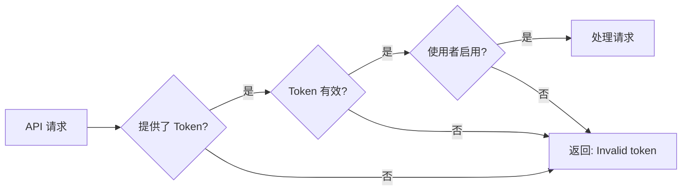

# 身份验证

WNCMS API 使用可配置的身份验证方法来保护 API 端点。本指南说明如何验证您的 API 请求。

## 身份验证方法

WNCMS 支援可按端点配置的多种身份验证模式：

| 模式     | 说明               | 使用情境         |
| -------- | ------------------ | ---------------- |
| **无**   | 不需要身份验证     | 公开端点         |
| **简易** | API token 身份验证 | 最常见，建议使用 |
| **基本** | HTTP 基本身份验证  | 旧系统           |

## 简易验证（建议）

使用 API token 的最常见身份验证方法。

### 产生 API Token

1. 登入您的 WNCMS 管理后台
2. 导览至您的使用者个人资料
3. 找到「API Token」区块
4. 点击「产生 Token」或复制现有 token
5. 安全地储存 token

### 使用 API Token

在请求主体中包含您的 API token：

```json
{
  "api_token": "your-api-token-here",
  "other_parameters": "..."
}
```

### 请求范例

```bash
curl -X POST "https://your-domain.com/api/v1/posts" \
  -H "Content-Type: application/json" \
  -d '{
    "api_token": "abc123def456ghi789jkl012mno345pqr678stu",
    "page_size": 10
  }'
```

### JavaScript 范例

```javascript
const response = await fetch('https://your-domain.com/api/v1/posts', {
  method: 'POST',
  headers: {
    'Content-Type': 'application/json',
  },
  body: JSON.stringify({
    api_token: 'your-api-token-here',
    page_size: 10,
  }),
})

const result = await response.json()
```

## Token 安全性

:::warning 安全性最佳实务

- **切勿**将 token 提交至版本控制
- **切勿**在客户端 JavaScript 中公开 token
- **始终**使用 HTTPS 来保护传输中的 token
- **定期**轮换 token
- 如果 token **泄露**，立即撤销
  :::

### 环境变数

将 token 储存在环境变数中：

#### Node.js (.env)

```bash
WNCMS_API_TOKEN=your-api-token-here
WNCMS_API_URL=https://your-domain.com
```

```javascript
const apiToken = process.env.WNCMS_API_TOKEN
const apiUrl = process.env.WNCMS_API_URL
```

#### PHP (.env)

```bash
WNCMS_API_TOKEN=your-api-token-here
```

```php
$apiToken = env('WNCMS_API_TOKEN');
```

#### Python (.env)

```python
import os
from dotenv import load_dotenv

load_dotenv()
api_token = os.getenv('WNCMS_API_TOKEN')
```

### Token 储存最佳实务

1. **仅限伺服器端**：将 token 保存在伺服器上，而不是在浏览器中
2. **加密储存**：对资料库储存使用加密
3. **有限范围**：为不同应用程式建立独立的 token
4. **有效期限**：实作 token 过期策略
5. **稽核日志**：追踪 token 使用情况和可疑活动

## 身份验证流程

### 1. Token 验证

当收到请求时：



### 2. 使用者身份验证

API 自动验证与 token 关联的使用者：

```php
// 在后台
$user = User::where('api_token', $request->api_token)->first();

if ($user) {
    auth()->login($user);
    // 使用者现在已验证
}
```

## 每个端点的配置

每个端点可以透过 WNCMS 全域设定配置自己的身份验证设定。

### 功能开关

端点可以启用/停用：

```php
// 设定范例
'wncms_api_posts_index' => true,      // 已启用
'wncms_api_posts_store' => true,      // 已启用
'wncms_api_posts_delete' => false,    // 已停用
```

### 身份验证要求

某些端点可能需要特定权限：

```php
// 仅限管理员端点范例
if (!$user->hasRole('admin')) {
    return response()->json([
        'status' => 'fail',
        'message' => 'Admin access required'
    ], 403);
}
```

## 常见身份验证场景

### 场景 1：公开读取，需验证写入

```javascript
// 读取文章 - 不需身份验证（如果已配置）
const posts = await fetch('/api/v1/posts', {
  method: 'GET',
})

// 建立文章 - 需要身份验证
const newPost = await fetch('/api/v1/posts/store', {
  method: 'POST',
  body: JSON.stringify({
    api_token: 'your-token',
    title: 'New Post',
    content: 'Content here',
  }),
})
```

### 场景 2：不同应用程式使用不同 Token

```javascript
// 行动应用程式 token
const mobileToken = process.env.MOBILE_API_TOKEN

// 网页应用程式 token
const webToken = process.env.WEB_API_TOKEN

// 管理仪表板 token
const adminToken = process.env.ADMIN_API_TOKEN
```

### 场景 3：Token 轮换

```javascript
async function rotateToken(currentToken) {
  // 1. 透过管理后台产生新 token
  const newToken = await generateNewToken()

  // 2. 更新环境变数
  process.env.WNCMS_API_TOKEN = newToken

  // 3. 撤销旧 token
  await revokeToken(currentToken)

  return newToken
}
```

## 错误回应

### 无效 Token

```json
{
  "status": "fail",
  "message": "Invalid token"
}
```

**原因：**

- Token 不正确
- Token 已被撤销
- 使用者帐户已停用

**解决方案：**

1. 验证 token 是否正确
2. 从管理后台重新产生 token
3. 检查使用者帐户状态

### API 已停用

```json
{
  "status": 403,
  "message": "API access is disabled"
}
```

**原因：**

- 设定中已停用 API 端点
- 全域 API 存取已关闭

**解决方案：**

1. 在 WNCMS 设定中启用特定端点
2. 联系系统管理员
3. 检查全域 API 配置

### 需要管理员权限

```json
{
  "status": "fail",
  "message": "Admin access required"
}
```

**原因：**

- 端点需要管理员角色
- 目前使用者不是管理员

**解决方案：**

1. 使用管理员使用者的 API token
2. 向管理员请求管理员权限

## 多使用者场景

### 多个使用者

每个使用者应该有自己的 API token：

```javascript
// 使用者 1 的 token
const user1Token = 'token_for_user_1'

// 使用者 2 的 token
const user2Token = 'token_for_user_2'

// 根据情境使用适当的 token
const token = currentUserId === 1 ? user1Token : user2Token
```

### 服务帐户

为 API 整合建立专用使用者：

1. 在 WNCMS 中建立新使用者帐户
2. 指派适当角色（例如「API 使用者」）
3. 为此使用者产生 API token
4. 将此 token 用于您的整合

**优点：**

- 更好的稽核轨迹
- 可以在不影响其他使用者的情况下撤销存取权限
- 指派特定权限

## 测试身份验证

### 测试 Token 有效性

```javascript
async function testToken(apiToken) {
  try {
    const response = await fetch('https://your-domain.com/api/v1/posts', {
      method: 'POST',
      headers: {
        'Content-Type': 'application/json',
      },
      body: JSON.stringify({
        api_token: apiToken,
        page_size: 1,
      }),
    })

    const result = await response.json()

    if (result.status === 'success') {
      console.log('✓ Token is valid')
      return true
    } else if (result.message === 'Invalid token') {
      console.log('✗ Token is invalid')
      return false
    } else {
      console.log('⚠ Token valid but endpoint disabled')
      return true // Token 有效，只是端点已停用
    }
  } catch (error) {
    console.error('Network error:', error)
    return false
  }
}

// 使用方式
const isValid = await testToken('your-api-token')
```

### 自动化 Token 验证

```javascript
class TokenValidator {
  constructor(apiUrl, apiToken) {
    this.apiUrl = apiUrl
    this.apiToken = apiToken
    this.isValid = null
    this.lastChecked = null
  }

  async validate() {
    const response = await fetch(`${this.apiUrl}/api/v1/posts`, {
      method: 'POST',
      headers: {
        'Content-Type': 'application/json',
      },
      body: JSON.stringify({
        api_token: this.apiToken,
        page_size: 1,
      }),
    })

    const result = await response.json()
    this.isValid = result.status === 'success' || result.status !== 'fail'
    this.lastChecked = new Date()

    return this.isValid
  }

  async ensureValid() {
    // 每小时检查一次
    if (!this.lastChecked || Date.now() - this.lastChecked > 3600000) {
      await this.validate()
    }

    if (!this.isValid) {
      throw new Error('API token is invalid')
    }

    return true
  }
}

// 使用方式
const validator = new TokenValidator('https://your-domain.com', 'your-api-token')

await validator.ensureValid() // 在继续之前验证
```

## 最佳实务

### 1. 始终使用 HTTPS

```javascript
// ✓ 正确
const apiUrl = 'https://your-domain.com/api/v1/posts'

// ✗ 错误 - 暴露 token
const apiUrl = 'http://your-domain.com/api/v1/posts'
```

### 2. 不要记录 Token

```javascript
// ✓ 正确
console.log('Making API request')

// ✗ 错误 - 记录敏感资料
console.log('Token:', apiToken)
```

### 3. 在标头中处理 Token（伺服器端）

对于伺服器端应用程式，您可以实作自定义中介软体来接受标头中的 token：

```javascript
// 自定义实作（非内建）
const response = await fetch(url, {
  headers: {
    Authorization: `Bearer ${apiToken}`,
  },
})
```

### 4. 实作 Token 更新

```javascript
class ApiClient {
  constructor() {
    this.token = process.env.API_TOKEN
    this.tokenExpiry = null
  }

  async refreshToken() {
    // 实作您的 token 更新逻辑
    // 这是特定于应用程式的
    this.token = await getNewToken()
    this.tokenExpiry = Date.now() + 24 * 60 * 60 * 1000 // 24 小时
  }

  async request(endpoint, data) {
    if (this.tokenExpiry && Date.now() > this.tokenExpiry) {
      await this.refreshToken()
    }

    return fetch(endpoint, {
      method: 'POST',
      body: JSON.stringify({
        api_token: this.token,
        ...data,
      }),
    })
  }
}
```

### 5. 限制请求速率

```javascript
class RateLimitedClient {
  constructor(apiToken, maxRequestsPerMinute = 60) {
    this.apiToken = apiToken
    this.maxRequests = maxRequestsPerMinute
    this.requests = []
  }

  async throttle() {
    const now = Date.now()
    this.requests = this.requests.filter((time) => now - time < 60000)

    if (this.requests.length >= this.maxRequests) {
      const waitTime = 60000 - (now - this.requests[0])
      await new Promise((resolve) => setTimeout(resolve, waitTime))
    }

    this.requests.push(now)
  }

  async request(url, data) {
    await this.throttle()

    return fetch(url, {
      method: 'POST',
      body: JSON.stringify({
        api_token: this.apiToken,
        ...data,
      }),
    })
  }
}
```

## 疑难排解

### 重新产生后 Token 无法使用

**问题：**新 token 返回「Invalid token」

**解决方案：**

1. 清除应用程式快取
2. 等待几秒钟以进行传播
3. 验证您复制了整个 token
4. 检查 token 字串中的空格

### 随机身份验证失败

**问题：**Token 有时有效，有时失败

**解决方案：**

1. 检查是否有多个伺服器负载平衡
2. 验证资料库复制是否正常运作
3. 寻找快取问题
4. 检查伺服器时间同步

### 无法产生 Token

**问题：**「产生 Token」按钮无法使用

**解决方案：**

1. 检查使用者权限
2. 验证管理后台存取权限
3. 检查浏览器控制台是否有 JavaScript 错误
4. 联系系统管理员

## 相关文件

- [入门指南](./getting-started.md) - 使用身份验证的第一个 API 呼叫
- [核心概念](./core-concepts.md) - 了解 API 回应
- [错误参考](./errors.md) - 身份验证错误代码
- [疑难排解](./troubleshooting.md) - 常见身份验证问题

## 安全检查清单

在部署到正式环境之前：

- [ ] API token 储存在环境变数中
- [ ] 所有 API 呼叫使用 HTTPS
- [ ] Token 未在客户端程式码中公开
- [ ] Token 未被记录或显示
- [ ] 已制定 token 轮换策略
- [ ] 已实作速率限制
- [ ] 错误讯息不暴露敏感资料
- [ ] 为不同环境使用独立的 token
- [ ] 已记录 token 撤销程序
- [ ] 已启用稽核日志记录
