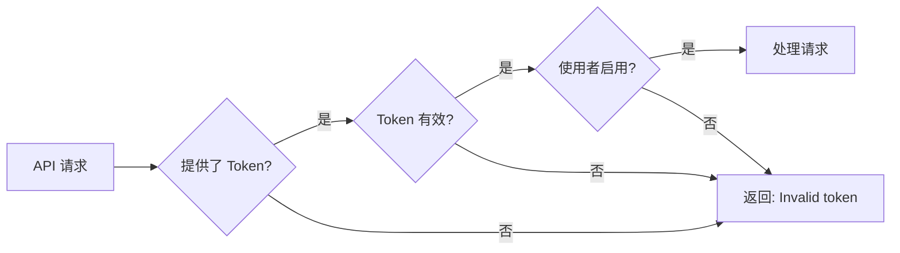

# 身份验证

WNCMS API 使用可配置的身份验证方法来保护 API 端点。本指南说明如何验证您的 API 请求。

## 身份验证方法

WNCMS 支援可按端点配置的多种身份验证模式：

| 模式     | 说明               | 使用情境         |
| -------- | ------------------ | ---------------- |
| **无**   | 不需要身份验证     | 公开端点         |
| **简易** | API token 身份验证 | 最常见，建议使用 |
| **基本** | HTTP 基本身份验证  | 旧系统           |

## 白名单闸道

**系统设定 -> API** 中的 `api_access_whitelist` 是 API 请求的全域附加检查。

- 留空时不启用白名单检查。
- 每行填写一个 IP 或域名，只有匹配的请求才会继续执行端点认证。
- IP 比对使用请求 IP。
- 域名比对使用请求 `Origin` 标头，并在缺少时回退到 `Referer`。

范例：

```text
111.222.333.444
example.com
example2.com
222.333.444.555
```

## Backend API v2 Bearer Token

Backend API v2 路由使用以下端点签发的 access token：

```text
POST /api/v2/backend/auth/login
```

将返回的 token 放入 bearer header：

```bash
curl "https://your-domain.com/api/v2/backend/links?website_id=1" \
  -H "Authorization: Bearer YOUR_TOKEN" \
  -H "Accept: application/json"
```

登入响应和 `GET /api/v2/backend/auth/me` 都会包含当前用户可安全公开的
网站启动列表。请求网站范围集合前，请使用 `websites[].id`（或其规范化
`website:{id}` key）选择 `X-Website-Id`/`website_id` 范围。这样客户端无需
预先知道网站 ID，就能发现当前用户可访问的网站。

拥有 Blade 管理员角色 `admin` 或 `superadmin` 的用户，即使没有任何
`website_user` pivot 记录，也会在此启动列表中取得所有现有网站。其他用户只会取得
明确关联的网站。签发及刷新 access token 的网站范围也采用相同规则。

```json
{
  "id": 29,
  "name": "Admin",
  "username": "admin",
  "email": "admin@example.test",
  "roles": ["superadmin"],
  "websites": [
    { "id": 1, "key": "website:1", "domain": "example.test", "site_name": "Example" }
  ]
}
```

### Refresh 传输模式

`api_refresh_transport` 选择一个互斥的 refresh 通道：

- `json`（预设）：登入和 refresh 返回 `refresh_token`；refresh 与 logout
  只接受 JSON body 中的 token。WNCMS 不读取或写入 refresh/CSRF cookie。
- `cookie`：登入和 refresh 绝不返回 refresh 明文。WNCMS 使用 Secure、
  HttpOnly 的 `__Secure-wncms_refresh` cookie，以及可读取的 Secure
  `wncms_refresh_csrf` cookie。两者的 path 均为
  `/api/v2/backend/auth`，预设为 host-only domain，并使用已验证的
  `SameSite` 策略。

Cookie 模式的登入、refresh 与 logout 要求完全匹配的允许 `Origin`，比较
scheme、host 与有效 port。缺少、`null`、wildcard、格式错误或未获准的值
都会被拒绝。仅当明确启用 `api_refresh_cookie_referer_fallback` 且没有
`Origin` 时，系统才会考虑 `Referer`。

Cookie refresh 与 logout 必须将 `wncms_refresh_csrf` 复制到
`X-WNCMS-CSRF` 标头。WNCMS 会比较两者，并验证它们与当前 session 的
精确 refresh credential 之间的 hash-only 绑定。带原始 proof 的重放可进入
reuse 检测，随机或过时 proof 仍会被拒绝。为兼容 SQL Server，JSON mode 的
session 与 refresh credential 允许 nullable proof 且不建立 database unique
index；Cookie proof 仍使用不可猜测的随机值、仅储存 hash 并以 `hash_equals`
比较。成功 refresh 会轮换两个 cookie；logout 和适用的 session
撤销会让两个 cookie 过期。Body/cookie 通道不一致返回
`authentication.refresh_transport_mismatch`，Origin 与 CSRF 失败分别返回
`authentication.origin_denied` 和 `authentication.csrf_failed`；两者都会写入
已脱敏的 security event。

Host 必须为完全匹配的配置 Origins 与 `api/v2/backend/auth/*` path 启用
credentialed CORS；credentials 不可搭配 `*` Origin。WNCMS 会加入精确的
`Access-Control-Allow-Origin`、`Access-Control-Allow-Credentials: true` 与
`Vary: Origin`，并处理 auth preflight。除非应用 URL/cookie 均为 HTTPS，且
host CORS 设置 `supports_credentials = true`、涵盖 auth path 与所有精确
Origins，否则 `SameSite=None` 会被拒绝。Host `allowed_origins` 不可包含
`*`，`allowed_origins_patterns` 必须为空；精确值与 wildcard 混用会 fail
closed。被拒绝的 actual 与 preflight 请求绝不会反射 CORS 许可标头。永久 remember credential 的浏览器
cookie 仍采用有界的 400 天持久期限，logout 始终按完全相同 scope 清除。覆盖范围包含
`auth/me` 在内的所有 auth routes，并支持 Laravel 风格的前后 slash 与
host-keyed `cors.paths`，以及 Laravel `fullUrlIs()` URL pattern。精确 path 项目
采用 Laravel 不受 query 影响的 `path()` 语义，但精确 full URL 无法证明覆盖
任意 query variant；full-URL 覆盖因此必须使用 path wildcard，例如
`https://api.example.test/api/v2/backend/auth/*`。参数化 session
删除 route 必须由 auth-wide wildcard 或明确的 `auth/sessions/*` wildcard 覆盖；
单一示例 session ID 的精确 path 不能证明已覆盖整个 route。

切换 refresh transport 会撤销所有 active interactive sessions；更改 Cookie
domain、SameSite、允许 Origins 或 Referer fallback 会撤销 active Cookie
sessions。Setting 写入、credential 撤销与必要的
`security.auth_policy.changed` event 会原子提交；service tokens 不受影响。

Origin 与 CSRF denial 会保留有限的 HMAC sample，并按 event type 与 UTC hour
将所有 attacker tuples 聚合为一行；重复 denial 只增加 aggregate，不会为每个
请求新增 row 或 info log。Event persistence 不可用时，已脱敏 warning fallback
会同时按 tuple 与全局限流；database、cache 与 logger 故障都不会改变 403。
必要的 success event notification 与 structured success log 只会在 event model
实际 database connection 的最外层 transaction commit 后发出；outer rollback
不会发出任何一项。Commit 后的 listener 或 logging 故障会被隔离，不能让已提交
请求失败。
若 host 覆盖 `api_security_event` model，该覆盖必须继承
`ApiSecurityEvent`、保留 `api_security_event` model key，并可拥有自定义默认
connection 与 table。除非明确传入 connection，否则 persistence、aggregation
与 post-commit notification 都使用该 model 自有的 storage。Aggregate 更新通过
`aggregate_key` 定位，不要求主键名为 `id`。必要的审计变更有更严格的要求：
操作涉及的 setting、session、access-token 与 refresh-token model 必须与
security-event model 解析到完全相同的命名 connection。WNCMS 会在调用变更前
完成此预检，任何不一致都会返回 audit-unavailable（API 为 `503`）；系统绝不会
假设跨数据库原子性。

```javascript
const csrf = readCookie('wncms_refresh_csrf')

await fetch('https://api.example.test/api/v2/backend/auth/refresh', {
  method: 'POST',
  credentials: 'include',
  headers: {
    'Content-Type': 'application/json',
    'X-WNCMS-CSRF': csrf,
  },
  body: '{}',
})
```

对于受保护的 Links mutation，此 token 关联的使用者始终是 automation actor。
系统会针对该使用者检查 `link_index`、`link_create`、`link_edit` 或
`link_delete`，强制写入也会把使用者 ID 记录在 `mutation_audits`。
Token 不会绕过网站范围。

### Step-up proof 与高风险 action plan

正式 v2 operation 的 security risk 独立于资料 mutation risk。Effective risk
取 operation 声明、normalized input 与当前 environment 的最高值。永久
credential 为 critical；跨站或 broad/full-admin grant 至少为 high。

Credential 与 security operation 使用
`POST /api/v2/backend/auth/reauthenticate`。它接受当前密码、正式 operation ID
及该 operation 声明的一个 purpose。只有 interactive session 能取得五分钟
proof。将 proof 一次性放入 `X-WNCMS-Step-Up`；WNCMS 只保存 hash，并绑定 actor、
精确 session、purpose、expiry 以及之后发生的密码或 session security event，
包括完成密码重设。密码检查失败会记录 audit，并按 account 与 IP 独立限流。若
operation 声明多个 purpose，执行时须以 `X-WNCMS-Step-Up-Purpose` 指定其中一个。

当 `api_high_risk_action_mode=planned` 时，符合资格的 high 与 critical
operation 先以 `operation`、原始 `input` 及识别目标所需的 route `parameters`
调用 `POST /api/v2/backend/action-plans`。客户端不可提交 target fingerprint 或
environment assertion；WNCMS 会依 operation schema 套用 type/default，并在服务器
解析当前 target fingerprint 与 environment。响应包含 opaque plan ID 与只显示一次的
confirmation；五分钟内将 confirmation 放入 `X-WNCMS-Confirmation`。它以原子
方式 single-use，并绑定 actor、credential public ID、适用的 interactive
session、operation、input、target state、website scope、ability/permission
结果与 effective risk。缺少 proof 或 plan 返回 `428`；expired、stale 或 reused
plan 返回稳定 `409`。正式 credential types 与一般 guard 允许时，service token 可
执行非 credential 的 high/critical operation；legacy credential 不可执行 critical
operation。Domain/outbox mutation、proof/plan 消费与 mandatory audit 必须在同一 named
database connection 原子提交。Async 只支持同 database 的 transactional outbox；直接
network 或外部 queue enqueue 会在执行前 fail closed。Idempotent retry 会在重新检查已
消费 confirmation 前 replay 已提交结果。

Package caller 只能为已声明 model boundary 的幂等 database 或
transactional-outbox operation 建立或执行 plan。公开 plan execution 会拒绝
caller-owned ambient transaction，确保 rollback 后的 denial audit 仍可持久保存。
Direct external operation 不会因此获得 planned atomicity，但 WNCMS 会在派发副作用前，
于自有 execution transaction 内重新检查当前 credential、ability 与 permission。

Production legacy operation 使用显式 security descriptor；WNCMS 不会从 HTTP
method 或 operation name 推断安全性。每条 configured route 都必须声明 credential
types、step-up 与 plan policy、domain/outbox model boundary、side-effect kind、request
canonicalizer、target resolver 及 idempotency；声明缺失或含糊时会 fail closed。目前
planned execution 只开放给 model 与 plan 使用相同 database connection 的 generic
resource mutation。Custom controller、dynamic-model operation、Spatie role/permission
mutation 及 external side effect 在提供同等 atomic boundary 前均不开放 planned
execution。

Plan 建立与执行使用相同的 server-owned canonicalizer。执行时 WNCMS 会开启 named
transaction，重新锁定并解析 target rows，然后重新采样当前 environment，再比较 plan
binding。Bulk binding 同时包含排序后的 requested IDs 与 locked rows，因此新增、删除或
原先缺失的 target 都会使 plan stale。Account 与 IP reauthentication limit 会在 token
authentication 后执行，让 account limit 绑定到实际 actor。

Generic resource descriptor 也会绑定所选 website rows，以及 target model 实际的
`websites` pivot membership。每个 `website_id` 与 `website_ids` 值都必须同时位于
credential scope 与 actor 当前可访问范围内。Website resource 的 route 或 bulk target
会按当前访问规则授权：`admin` 与 `superadmin` 可访问所有现有网站，其他用户则必须是
网站拥有者或具有明确的网站关联。这些 route 或 bulk target ID 本身就是 authoritative
website scope，即使 Website model 在其他语义上是 global。
Website-scoped create 要求非空 binding；update 在省略所有 website selector 时保留当前
pivot membership。提供 selector 时，`website_key` 会解析为 canonical ID；明确的空值、
`null`、空字串，以及 `website_id`、`website_ids`、`website_key` 之间的冲突都会被拒绝。
Plan 与 mutation 使用同一个 canonical binding。超出 actor 当前访问范围的
website-scoped target 会被拒绝。执行 transaction 内会重新锁定并检查 fresh actor row、
管理员角色、actor-to-website relationship、website ownership、target rows、website rows 与 pivots。
Actor 失去当前访问权时会在执行前被拒绝；planned target state 缺失会使 plan stale，
direct execution 则 fail closed。Target、actor、website、pivot、plan、proof 与
security-event model 必须解析到同一个 named database connection，否则 plan 创建或
执行会在 side effect 前 fail closed。Global model 在显式选择的 website 通过一般 scope
授权后，仍保留 global target semantics。

Action plan 创建会先按 target operation 检查 accepted credential type、ability、当前
permission、website scope 与 actor 当前访问权。Credential、ability 与 authoritative
direct/role permission snapshot 会在 target 或 website resolution 前检查，避免未授权 caller
由后续错误推断 target 是否存在。Permission model 及 direct、role、role-permission pivot
必须使用同一个 named connection。系统在同一个 named transaction 内锁定并
解析 authorization/target snapshot，然后原子写入 hash-only plan 与 mandatory
`risk.plan.created` event。未授权请求不会建立任何一列；audit 失败会回滚 plan，也不会
返回 plaintext confirmation。
公开的 `ActionPlanService` 创建方法同样强制此边界，direct package caller 无法绕过授权或
mandatory audit。Bulk operation 在 direct execution 与 plan 创建时要求所有 requested target
存在；有效 plan 建立后 target 消失则返回 `risk.plan_stale`。
公开 `consume` contract 必须在 caller 没有开启 database transaction 时调用；若已有 outer
transaction，会在读取或修改任何 security state 前 fail closed。HTTP execution 使用内部
middleware executor，由它拥有完整的 domain、plan、proof 与 event boundary。

启用 Spatie 通配符权限时，锁定的授权快照会对刚从数据库读取的直接与角色授权套用已配置的通配符实现，不会使用权限注册器的陈旧缓存，并保留 guard 与 team 范围语义。关闭通配符支持时，精确权限行为维持不变。

单站模型只接受一个规范化的 `website_id`、`website_key`，或只含一项的 `website_ids`。提供多个不同网站会返回 `422 validation.failed`；WNCMS 不会静默选取第一个值。计划创建、直接执行与资源控制器使用同一模型网站模式和规范绑定。
单站 PATCH 省略所有 selector 时，现有 binding 也必须正好包含一个网站；现有 membership 为零或多笔时返回 `422 validation.failed`。

执行会在任何副作用前，以事务内重新读取的目标与环境快照重算有效风险，再重新套用计划资格、凭证、step-up 与高风险模式规则。因此 normal→high 的即时升级在没有确认码时返回 `428 risk.plan_required`，操作不具计划资格时返回 `503 risk.policy_unavailable`，而已提供计划与新风险或环境绑定不符时返回 `409 risk.plan_stale`。直接模式仍会执行其凭证限制。

计划过时或确认码重复使用时，会先回滚完整领域事务，再于相同具名连接的独立事务中准确写入一笔必要的 `risk.plan.stale` 或 `risk.confirmation.reused` 事件，并包含稳定错误代码与 HTTP 状态。若拒绝审计无法提交，最终响应为 `503 security.audit_unavailable`；领域变更与确认状态均保持不变。

Descriptor 的 `ability` 与 data `risk` 是语义声明，不会从 HTTP method 推导。Registry
启动时会拒绝 resource/bridge operation-ID collision，除非 ID 位于经审核的 override
清单。Direct mode 可执行已授权的 external bridge，但没有 transactional plan guarantee；
planned mode 下不符合 plan 资格的 high/critical bridge 会返回
`risk.policy_unavailable`。Reauthentication 达到 account 或 IP limit 时，`429` denial
会以 rate-limited context 记录为 `auth.step_up.failed`；mandatory audit 无法持久化时，
WNCMS 返回 `503`。

## 简易验证（建议）

使用 API token 的最常见身份验证方法。

### 产生 API Token

1. 登入您的 WNCMS 管理后台
2. 导览至您的使用者个人资料
3. 找到「API Token」区块
4. 点击「产生 Token」或复制现有 token
5. 安全地储存 token

### 使用 API Token

在请求主体中包含您的 API token：

```json
{
  "api_token": "your-api-token-here",
  "other_parameters": "..."
}
```

### 请求范例

```bash
curl -X POST "https://your-domain.com/api/v1/posts" \
  -H "Content-Type: application/json" \
  -d '{
    "api_token": "abc123def456ghi789jkl012mno345pqr678stu",
    "page_size": 10
  }'
```

### JavaScript 范例

```javascript
const response = await fetch('https://your-domain.com/api/v1/posts', {
  method: 'POST',
  headers: {
    'Content-Type': 'application/json',
  },
  body: JSON.stringify({
    api_token: 'your-api-token-here',
    page_size: 10,
  }),
})

const result = await response.json()
```

## Basic 验证

Basic 模式使用标准 HTTP `Authorization: Basic ...` 标头，格式为 `email:password`。

### 请求范例

```bash
curl -X GET "https://your-domain.com/api/v1/posts" \
  -H "Authorization: Basic $(printf '%s' 'user@example.com:your-password' | base64)"
```

如果该端点同时配置了白名单，请求必须先通过白名单检查，才会验证 Basic 凭证。

## Token 安全性

:::warning 安全性最佳实务

- **切勿**将 token 提交至版本控制
- **切勿**在客户端 JavaScript 中公开 token
- **始终**使用 HTTPS 来保护传输中的 token
- **定期**轮换 token
- 如果 token **泄露**，立即撤销
  :::

### 环境变数

将 token 储存在环境变数中：

#### Node.js (.env)

```bash
WNCMS_API_TOKEN=your-api-token-here
WNCMS_API_URL=https://your-domain.com
```

```javascript
const apiToken = process.env.WNCMS_API_TOKEN
const apiUrl = process.env.WNCMS_API_URL
```

#### PHP (.env)

```bash
WNCMS_API_TOKEN=your-api-token-here
```

```php
$apiToken = env('WNCMS_API_TOKEN');
```

#### Python (.env)

```python
import os
from dotenv import load_dotenv

load_dotenv()
api_token = os.getenv('WNCMS_API_TOKEN')
```

### Token 储存最佳实务

1. **仅限伺服器端**：将 token 保存在伺服器上，而不是在浏览器中
2. **加密储存**：对资料库储存使用加密
3. **有限范围**：为不同应用程式建立独立的 token
4. **有效期限**：实作 token 过期策略
5. **稽核日志**：追踪 token 使用情况和可疑活动

## 身份验证流程

### 1. Token 验证

当收到请求时：


```mermaid
graph LR
    A[API 请求] --> B{提供了 Token?}
    B -->|是| C{Token 有效?}
    B -->|否| D[返回: Invalid token]
    C -->|是| E{使用者启用?}
    C -->|否| D
    E -->|是| F[处理请求]
    E -->|否| D
```

### 2. 使用者身份验证

API 自动验证与 token 关联的使用者：

```php
// 在后台
$user = User::where('api_token', $request->api_token)->first();

if ($user) {
    auth()->login($user);
    // 使用者现在已验证
}
```

## 每个端点的配置

每个端点可以透过 WNCMS 全域设定配置自己的身份验证设定。

### 功能开关

端点可以启用/停用：

```php
// 设定范例
'wncms_api_posts_index' => true,      // 已启用
'wncms_api_posts_store' => true,      // 已启用
'wncms_api_posts_delete' => false,    // 已停用
```

### 身份验证要求

某些端点可能需要特定权限：

```php
// 仅限管理员端点范例
if (!$user->hasRole('admin')) {
    return response()->json([
        'status' => 'fail',
        'message' => 'Admin access required'
    ], 403);
}
```

## 常见身份验证场景

### 场景 1：公开读取，需验证写入

```javascript
// 读取文章 - 不需身份验证（如果已配置）
const posts = await fetch('/api/v1/posts', {
  method: 'GET',
})

// 建立文章 - 需要身份验证
const newPost = await fetch('/api/v1/posts/store', {
  method: 'POST',
  body: JSON.stringify({
    api_token: 'your-token',
    title: 'New Post',
    content: 'Content here',
  }),
})
```

### 场景 2：不同应用程式使用不同 Token

```javascript
// 行动应用程式 token
const mobileToken = process.env.MOBILE_API_TOKEN

// 网页应用程式 token
const webToken = process.env.WEB_API_TOKEN

// 管理仪表板 token
const adminToken = process.env.ADMIN_API_TOKEN
```

### 场景 3：Token 轮换

```javascript
async function rotateToken(currentToken) {
  // 1. 透过管理后台产生新 token
  const newToken = await generateNewToken()

  // 2. 更新环境变数
  process.env.WNCMS_API_TOKEN = newToken

  // 3. 撤销旧 token
  await revokeToken(currentToken)

  return newToken
}
```

## 错误回应

### 无效 Token

```json
{
  "status": "fail",
  "message": "Invalid token"
}
```

**原因：**

- Token 不正确
- Token 已被撤销
- 使用者帐户已停用

**解决方案：**

1. 验证 token 是否正确
2. 从管理后台重新产生 token
3. 检查使用者帐户状态

### API 已停用

```json
{
  "status": 403,
  "message": "API access is disabled"
}
```

**原因：**

- 设定中已停用 API 端点
- 全域 API 存取已关闭

**解决方案：**

1. 在 WNCMS 设定中启用特定端点
2. 联系系统管理员
3. 检查全域 API 配置

### 需要管理员权限

```json
{
  "status": "fail",
  "message": "Admin access required"
}
```

**原因：**

- 端点需要管理员角色
- 目前使用者不是管理员

**解决方案：**

1. 使用管理员使用者的 API token
2. 向管理员请求管理员权限

## 多使用者场景

### 多个使用者

每个使用者应该有自己的 API token：

```javascript
// 使用者 1 的 token
const user1Token = 'token_for_user_1'

// 使用者 2 的 token
const user2Token = 'token_for_user_2'

// 根据情境使用适当的 token
const token = currentUserId === 1 ? user1Token : user2Token
```

### 服务帐户

为 API 整合建立专用使用者：

1. 在 WNCMS 中建立新使用者帐户
2. 指派适当角色（例如「API 使用者」）
3. 为此使用者产生 API token
4. 将此 token 用于您的整合

**优点：**

- 更好的稽核轨迹
- 可以在不影响其他使用者的情况下撤销存取权限
- 指派特定权限

## 测试身份验证

### 测试 Token 有效性

```javascript
async function testToken(apiToken) {
  try {
    const response = await fetch('https://your-domain.com/api/v1/posts', {
      method: 'POST',
      headers: {
        'Content-Type': 'application/json',
      },
      body: JSON.stringify({
        api_token: apiToken,
        page_size: 1,
      }),
    })

    const result = await response.json()

    if (result.status === 'success') {
      console.log('✓ Token is valid')
      return true
    } else if (result.message === 'Invalid token') {
      console.log('✗ Token is invalid')
      return false
    } else {
      console.log('⚠ Token valid but endpoint disabled')
      return true // Token 有效，只是端点已停用
    }
  } catch (error) {
    console.error('Network error:', error)
    return false
  }
}

// 使用方式
const isValid = await testToken('your-api-token')
```

### 自动化 Token 验证

```javascript
class TokenValidator {
  constructor(apiUrl, apiToken) {
    this.apiUrl = apiUrl
    this.apiToken = apiToken
    this.isValid = null
    this.lastChecked = null
  }

  async validate() {
    const response = await fetch(`${this.apiUrl}/api/v1/posts`, {
      method: 'POST',
      headers: {
        'Content-Type': 'application/json',
      },
      body: JSON.stringify({
        api_token: this.apiToken,
        page_size: 1,
      }),
    })

    const result = await response.json()
    this.isValid = result.status === 'success' || result.status !== 'fail'
    this.lastChecked = new Date()

    return this.isValid
  }

  async ensureValid() {
    // 每小时检查一次
    if (!this.lastChecked || Date.now() - this.lastChecked > 3600000) {
      await this.validate()
    }

    if (!this.isValid) {
      throw new Error('API token is invalid')
    }

    return true
  }
}

// 使用方式
const validator = new TokenValidator('https://your-domain.com', 'your-api-token')

await validator.ensureValid() // 在继续之前验证
```

## 最佳实务

### 1. 始终使用 HTTPS

```javascript
// ✓ 正确
const apiUrl = 'https://your-domain.com/api/v1/posts'

// ✗ 错误 - 暴露 token
const apiUrl = 'http://your-domain.com/api/v1/posts'
```

### 2. 不要记录 Token

```javascript
// ✓ 正确
console.log('Making API request')

// ✗ 错误 - 记录敏感资料
console.log('Token:', apiToken)
```

### 3. 在标头中处理 Token（伺服器端）

对于伺服器端应用程式，您可以实作自定义中介软体来接受标头中的 token：

```javascript
// 自定义实作（非内建）
const response = await fetch(url, {
  headers: {
    Authorization: `Bearer ${apiToken}`,
  },
})
```

### 4. 实作 Token 更新

```javascript
class ApiClient {
  constructor() {
    this.token = process.env.API_TOKEN
    this.tokenExpiry = null
  }

  async refreshToken() {
    // 实作您的 token 更新逻辑
    // 这是特定于应用程式的
    this.token = await getNewToken()
    this.tokenExpiry = Date.now() + 24 * 60 * 60 * 1000 // 24 小时
  }

  async request(endpoint, data) {
    if (this.tokenExpiry && Date.now() > this.tokenExpiry) {
      await this.refreshToken()
    }

    return fetch(endpoint, {
      method: 'POST',
      body: JSON.stringify({
        api_token: this.token,
        ...data,
      }),
    })
  }
}
```

### 5. 限制请求速率

```javascript
class RateLimitedClient {
  constructor(apiToken, maxRequestsPerMinute = 60) {
    this.apiToken = apiToken
    this.maxRequests = maxRequestsPerMinute
    this.requests = []
  }

  async throttle() {
    const now = Date.now()
    this.requests = this.requests.filter((time) => now - time < 60000)

    if (this.requests.length >= this.maxRequests) {
      const waitTime = 60000 - (now - this.requests[0])
      await new Promise((resolve) => setTimeout(resolve, waitTime))
    }

    this.requests.push(now)
  }

  async request(url, data) {
    await this.throttle()

    return fetch(url, {
      method: 'POST',
      body: JSON.stringify({
        api_token: this.apiToken,
        ...data,
      }),
    })
  }
}
```

## 使用者安全生命周期

API 提供稳定的密码、个人资料与 Email 验证路由：

```text
POST  /api/v2/backend/auth/password/forgot
POST  /api/v2/backend/auth/password/reset
PATCH /api/v2/backend/auth/password
PATCH /api/v2/backend/auth/profile
POST  /api/v2/backend/auth/email/change
POST  /api/v2/backend/auth/email/change/confirm
POST  /api/v2/backend/auth/email-verification/send
POST  /api/v2/backend/auth/email-verification/verify
```

忘记密码始终返回相同的 accepted envelope。密码重设与 Email 验证连结使用设定的 `WNCMS_API_AUTH_CLIENT_CALLBACK_URL`；客户端再将 opaque credential 提交回 API。验证凭证有期限、仅储存 hash，且只能使用一次。Email 变更会保留并通知旧地址，直到新地址确认完成。

密码与 Email 变更需要 interactive access token 及用途限定的 step-up proof。密码变更或重设会原子撤销所有 interactive sessions、access/refresh tokens、service tokens、v1 `users.api_token`，并且只删除 morph type 与使用者 ID 完全相符的 legacy PAT；其他使用者及 morph type 会保留。成功的密码回应返回 `reauthentication_required: true`。

## Legacy Personal Token 迁移

Legacy PAT 接受机制是临时且只读的 adapter。它要求启用 `api_legacy_personal_tokens_enabled`、设有未来 UTC `api_legacy_personal_tokens_cutoff_at`、正式 operation 明确允许、contract 非 critical／credential、目前 WNCMS 权限有效，而且使用者只有一个可存取网站。Legacy `*` ability 不会绕过权限或网站范围。成功回应包含 `Deprecation`、`Sunset`、`Link` 与 `X-WNCMS-Credential-Type` headers。

```text
php artisan wncms:auth:legacy-status --json
php artisan wncms:auth:legacy-cutoff "2026-12-01T00:00:00Z" --json
php artisan wncms:auth:legacy-revoke-all --force --json
```

Adapter 只检查 host schema 的必要与选用栏位，不会修改 schema。`legacy-revoke-all` 只变更 WNCMS 接受设定，不会删除 host token rows。超过 365 天的 cutoff 同时需要 `--override-max` 与 `--force`。

## 限定范围的 Service Token

Service token 管理仅允许 interactive session 使用。API 提供以下路由：

```text
GET    /api/v2/backend/auth/service-token-options
GET    /api/v2/backend/auth/service-tokens
POST   /api/v2/backend/auth/service-tokens
GET    /api/v2/backend/auth/service-tokens/{token_id}
POST   /api/v2/backend/auth/service-tokens/{token_id}/rotate
DELETE /api/v2/backend/auth/service-tokens/{token_id}
```

建立时选择 `read_only`、`content_editor`、`site_manager` 或 `full_admin`，并明确传入 `website_ids`，以及 `30`、`90`、`365` 或 `permanent` 的 `expires_in_days`。授权范围受正式 operation registry、操作者目前权限、access token abilities 与网站成员资格共同限制。多个网站需要 `api_token_create_cross_site`；永久 token 需要 `api_token_create_permanent`。凭证管理能力永远不能委派。

建立、轮换和撤销需要 idempotency key，以及用途限定的 step-up proof（`service_token.create`、`service_token.rotate` 或 `service_token.revoke`）。建立和轮换仅在成功回应中回传一次明文；五分钟 replay window 会加密储存该回应。列表与详情不会回传 hash、明文或 secret 片段。轮换会原子停用旧凭证；未知与跨使用者 ID 返回相同的 `404`。

## 疑难排解

### 重新产生后 Token 无法使用

**问题：**新 token 返回「Invalid token」

**解决方案：**

1. 清除应用程式快取
2. 等待几秒钟以进行传播
3. 验证您复制了整个 token
4. 检查 token 字串中的空格

### 随机身份验证失败

**问题：**Token 有时有效，有时失败

**解决方案：**

1. 检查是否有多个伺服器负载平衡
2. 验证资料库复制是否正常运作
3. 寻找快取问题
4. 检查伺服器时间同步

### 无法产生 Token

**问题：**「产生 Token」按钮无法使用

**解决方案：**

1. 检查使用者权限
2. 验证管理后台存取权限
3. 检查浏览器控制台是否有 JavaScript 错误
4. 联系系统管理员

## 相关文件

- [入门指南](./getting-started.md) - 使用身份验证的第一个 API 呼叫
- [核心概念](./core-concepts.md) - 了解 API 回应
- [错误参考](./errors.md) - 身份验证错误代码
- [疑难排解](./troubleshooting.md) - 常见身份验证问题

## 安全检查清单

在部署到正式环境之前：

- [ ] API token 储存在环境变数中
- [ ] 所有 API 呼叫使用 HTTPS
- [ ] Token 未在客户端程式码中公开
- [ ] Token 未被记录或显示
- [ ] 已制定 token 轮换策略
- [ ] 已实作速率限制
- [ ] 错误讯息不暴露敏感资料
- [ ] 为不同环境使用独立的 token
- [ ] 已记录 token 撤销程序
- [ ] 已启用稽核日志记录
## Blade UI 恢复模式

WNCMS 可停用自身的 Blade Web 界面，同时保留 API v2 与宿主应用路由。使用 `GET /api/v2/backend/security/blade` 读取状态；以 `PATCH /api/v2/backend/security/blade` 及 `{ "enabled": false }` 更新状态。两者都需要 interactive access token、`security.blade` ability 与 `blade_mode_manage`；更新另需 idempotency 与 `blade.mode` step-up proof。

CLI 恢复入口为 `wncms:blade:status`、`wncms:blade:disable --force` 及 `wncms:blade:enable`。设置缺少时视为启用；已安装系统若设置无效或无法读取，WNCMS UI 路由会 fail closed 并返回纯文本 `404`。API、callback 与宿主路由不受 gate 影响。

## 安全事件查询与保留期

交互式管理员可使用 `security.events` ability，以及对应的 `security_event_index` 或 `security_event_show` 权限，查询只读且受网站范围限制的 `GET /api/v2/backend/security/events` 与 `GET /api/v2/backend/security/events/{event_id}`。超出凭证网站范围的事件与不存在事件一样返回 `404`；响应不含 event context 与任何 correlation hash。

`wncms:auth:prune-security-events` 依 `api_security_event_retention_days`（30–365 天）以每批最多 500 条删除到期事件，并记录完成事件。WNCMS 每日调度执行且禁止重叠。
