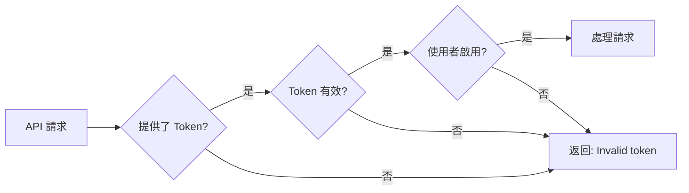

# 身份驗證

WNCMS API 使用可配置的身份驗證方法來保護 API 端點。本指南說明如何驗證您的 API 請求。

## 身份驗證方法

WNCMS 支援可按端點配置的多種身份驗證模式：

| 模式     | 說明               | 使用情境         |
| -------- | ------------------ | ---------------- |
| **無**   | 不需要身份驗證     | 公開端點         |
| **簡易** | API token 身份驗證 | 最常見，建議使用 |
| **基本** | HTTP 基本身份驗證  | 舊系統           |

## 簡易驗證（建議）

使用 API token 的最常見身份驗證方法。

### 產生 API Token

1. 登入您的 WNCMS 管理後台
2. 導覽至您的使用者個人資料
3. 找到「API Token」區塊
4. 點擊「產生 Token」或複製現有 token
5. 安全地儲存 token

### 使用 API Token

在請求主體中包含您的 API token：

```json
{
  "api_token": "your-api-token-here",
  "other_parameters": "..."
}
```

### 請求範例

```bash
curl -X POST "https://your-domain.com/api/v1/posts" \
  -H "Content-Type: application/json" \
  -d '{
    "api_token": "abc123def456ghi789jkl012mno345pqr678stu",
    "page_size": 10
  }'
```

### JavaScript 範例

```javascript
const response = await fetch('https://your-domain.com/api/v1/posts', {
  method: 'POST',
  headers: {
    'Content-Type': 'application/json',
  },
  body: JSON.stringify({
    api_token: 'your-api-token-here',
    page_size: 10,
  }),
})

const result = await response.json()
```

## Token 安全性

:::warning 安全性最佳實務

- **切勿**將 token 提交至版本控制
- **切勿**在客戶端 JavaScript 中公開 token
- **始終**使用 HTTPS 來保護傳輸中的 token
- **定期**輪換 token
- 如果 token **洩露**，立即撤銷
  :::

### 環境變數

將 token 儲存在環境變數中：

#### Node.js (.env)

```bash
WNCMS_API_TOKEN=your-api-token-here
WNCMS_API_URL=https://your-domain.com
```

```javascript
const apiToken = process.env.WNCMS_API_TOKEN
const apiUrl = process.env.WNCMS_API_URL
```

#### PHP (.env)

```bash
WNCMS_API_TOKEN=your-api-token-here
```

```php
$apiToken = env('WNCMS_API_TOKEN');
```

#### Python (.env)

```python
import os
from dotenv import load_dotenv

load_dotenv()
api_token = os.getenv('WNCMS_API_TOKEN')
```

### Token 儲存最佳實務

1. **僅限伺服器端**：將 token 保存在伺服器上，而不是在瀏覽器中
2. **加密儲存**：對資料庫儲存使用加密
3. **有限範圍**：為不同應用程式建立獨立的 token
4. **有效期限**：實作 token 過期策略
5. **稽核日誌**：追蹤 token 使用情況和可疑活動

## 身份驗證流程

### 1. Token 驗證

當收到請求時：



### 2. 使用者身份驗證

API 自動驗證與 token 關聯的使用者：

```php
// 在後台
$user = User::where('api_token', $request->api_token)->first();

if ($user) {
    auth()->login($user);
    // 使用者現在已驗證
}
```

## 每個端點的配置

每個端點可以透過 WNCMS 全域設定配置自己的身份驗證設定。

### 功能開關

端點可以啟用/停用：

```php
// 設定範例
'wncms_api_posts_index' => true,      // 已啟用
'wncms_api_posts_store' => true,      // 已啟用
'wncms_api_posts_delete' => false,    // 已停用
```

### 身份驗證要求

某些端點可能需要特定權限：

```php
// 僅限管理員端點範例
if (!$user->hasRole('admin')) {
    return response()->json([
        'status' => 'fail',
        'message' => 'Admin access required'
    ], 403);
}
```

## 常見身份驗證場景

### 場景 1：公開讀取，需驗證寫入

```javascript
// 讀取文章 - 不需身份驗證（如果已配置）
const posts = await fetch('/api/v1/posts', {
  method: 'GET',
})

// 建立文章 - 需要身份驗證
const newPost = await fetch('/api/v1/posts/store', {
  method: 'POST',
  body: JSON.stringify({
    api_token: 'your-token',
    title: 'New Post',
    content: 'Content here',
  }),
})
```

### 場景 2：不同應用程式使用不同 Token

```javascript
// 行動應用程式 token
const mobileToken = process.env.MOBILE_API_TOKEN

// 網頁應用程式 token
const webToken = process.env.WEB_API_TOKEN

// 管理儀表板 token
const adminToken = process.env.ADMIN_API_TOKEN
```

### 場景 3：Token 輪換

```javascript
async function rotateToken(currentToken) {
  // 1. 透過管理後台產生新 token
  const newToken = await generateNewToken()

  // 2. 更新環境變數
  process.env.WNCMS_API_TOKEN = newToken

  // 3. 撤銷舊 token
  await revokeToken(currentToken)

  return newToken
}
```

## 錯誤回應

### 無效 Token

```json
{
  "status": "fail",
  "message": "Invalid token"
}
```

**原因：**

- Token 不正確
- Token 已被撤銷
- 使用者帳戶已停用

**解決方案：**

1. 驗證 token 是否正確
2. 從管理後台重新產生 token
3. 檢查使用者帳戶狀態

### API 已停用

```json
{
  "status": 403,
  "message": "API access is disabled"
}
```

**原因：**

- 設定中已停用 API 端點
- 全域 API 存取已關閉

**解決方案：**

1. 在 WNCMS 設定中啟用特定端點
2. 聯繫系統管理員
3. 檢查全域 API 配置

### 需要管理員權限

```json
{
  "status": "fail",
  "message": "Admin access required"
}
```

**原因：**

- 端點需要管理員角色
- 目前使用者不是管理員

**解決方案：**

1. 使用管理員使用者的 API token
2. 向管理員請求管理員權限

## 多使用者場景

### 多個使用者

每個使用者應該有自己的 API token：

```javascript
// 使用者 1 的 token
const user1Token = 'token_for_user_1'

// 使用者 2 的 token
const user2Token = 'token_for_user_2'

// 根據情境使用適當的 token
const token = currentUserId === 1 ? user1Token : user2Token
```

### 服務帳戶

為 API 整合建立專用使用者：

1. 在 WNCMS 中建立新使用者帳戶
2. 指派適當角色（例如「API 使用者」）
3. 為此使用者產生 API token
4. 將此 token 用於您的整合

**優點：**

- 更好的稽核軌跡
- 可以在不影響其他使用者的情況下撤銷存取權限
- 指派特定權限

## 測試身份驗證

### 測試 Token 有效性

```javascript
async function testToken(apiToken) {
  try {
    const response = await fetch('https://your-domain.com/api/v1/posts', {
      method: 'POST',
      headers: {
        'Content-Type': 'application/json',
      },
      body: JSON.stringify({
        api_token: apiToken,
        page_size: 1,
      }),
    })

    const result = await response.json()

    if (result.status === 'success') {
      console.log('✓ Token is valid')
      return true
    } else if (result.message === 'Invalid token') {
      console.log('✗ Token is invalid')
      return false
    } else {
      console.log('⚠ Token valid but endpoint disabled')
      return true // Token 有效，只是端點已停用
    }
  } catch (error) {
    console.error('Network error:', error)
    return false
  }
}

// 使用方式
const isValid = await testToken('your-api-token')
```

### 自動化 Token 驗證

```javascript
class TokenValidator {
  constructor(apiUrl, apiToken) {
    this.apiUrl = apiUrl
    this.apiToken = apiToken
    this.isValid = null
    this.lastChecked = null
  }

  async validate() {
    const response = await fetch(`${this.apiUrl}/api/v1/posts`, {
      method: 'POST',
      headers: {
        'Content-Type': 'application/json',
      },
      body: JSON.stringify({
        api_token: this.apiToken,
        page_size: 1,
      }),
    })

    const result = await response.json()
    this.isValid = result.status === 'success' || result.status !== 'fail'
    this.lastChecked = new Date()

    return this.isValid
  }

  async ensureValid() {
    // 每小時檢查一次
    if (!this.lastChecked || Date.now() - this.lastChecked > 3600000) {
      await this.validate()
    }

    if (!this.isValid) {
      throw new Error('API token is invalid')
    }

    return true
  }
}

// 使用方式
const validator = new TokenValidator('https://your-domain.com', 'your-api-token')

await validator.ensureValid() // 在繼續之前驗證
```

## 最佳實務

### 1. 始終使用 HTTPS

```javascript
// ✓ 正確
const apiUrl = 'https://your-domain.com/api/v1/posts'

// ✗ 錯誤 - 暴露 token
const apiUrl = 'http://your-domain.com/api/v1/posts'
```

### 2. 不要記錄 Token

```javascript
// ✓ 正確
console.log('Making API request')

// ✗ 錯誤 - 記錄敏感資料
console.log('Token:', apiToken)
```

### 3. 在標頭中處理 Token（伺服器端）

對於伺服器端應用程式，您可以實作自定義中介軟體來接受標頭中的 token：

```javascript
// 自定義實作（非內建）
const response = await fetch(url, {
  headers: {
    Authorization: `Bearer ${apiToken}`,
  },
})
```

### 4. 實作 Token 更新

```javascript
class ApiClient {
  constructor() {
    this.token = process.env.API_TOKEN
    this.tokenExpiry = null
  }

  async refreshToken() {
    // 實作您的 token 更新邏輯
    // 這是特定於應用程式的
    this.token = await getNewToken()
    this.tokenExpiry = Date.now() + 24 * 60 * 60 * 1000 // 24 小時
  }

  async request(endpoint, data) {
    if (this.tokenExpiry && Date.now() > this.tokenExpiry) {
      await this.refreshToken()
    }

    return fetch(endpoint, {
      method: 'POST',
      body: JSON.stringify({
        api_token: this.token,
        ...data,
      }),
    })
  }
}
```

### 5. 限制請求速率

```javascript
class RateLimitedClient {
  constructor(apiToken, maxRequestsPerMinute = 60) {
    this.apiToken = apiToken
    this.maxRequests = maxRequestsPerMinute
    this.requests = []
  }

  async throttle() {
    const now = Date.now()
    this.requests = this.requests.filter((time) => now - time < 60000)

    if (this.requests.length >= this.maxRequests) {
      const waitTime = 60000 - (now - this.requests[0])
      await new Promise((resolve) => setTimeout(resolve, waitTime))
    }

    this.requests.push(now)
  }

  async request(url, data) {
    await this.throttle()

    return fetch(url, {
      method: 'POST',
      body: JSON.stringify({
        api_token: this.apiToken,
        ...data,
      }),
    })
  }
}
```

## 疑難排解

### 重新產生後 Token 無法使用

**問題：**新 token 返回「Invalid token」

**解決方案：**

1. 清除應用程式快取
2. 等待幾秒鐘以進行傳播
3. 驗證您複製了整個 token
4. 檢查 token 字串中的空格

### 隨機身份驗證失敗

**問題：**Token 有時有效，有時失敗

**解決方案：**

1. 檢查是否有多個伺服器負載平衡
2. 驗證資料庫複製是否正常運作
3. 尋找快取問題
4. 檢查伺服器時間同步

### 無法產生 Token

**問題：**「產生 Token」按鈕無法使用

**解決方案：**

1. 檢查使用者權限
2. 驗證管理後台存取權限
3. 檢查瀏覽器控制台是否有 JavaScript 錯誤
4. 聯繫系統管理員

## 相關文件

- [入門指南](./getting-started.md) - 使用身份驗證的第一個 API 呼叫
- [核心概念](./core-concepts.md) - 了解 API 回應
- [錯誤參考](./errors.md) - 身份驗證錯誤代碼
- [疑難排解](./troubleshooting.md) - 常見身份驗證問題

## 安全檢查清單

在部署到正式環境之前：

- [ ] API token 儲存在環境變數中
- [ ] 所有 API 呼叫使用 HTTPS
- [ ] Token 未在客戶端程式碼中公開
- [ ] Token 未被記錄或顯示
- [ ] 已制定 token 輪換策略
- [ ] 已實作速率限制
- [ ] 錯誤訊息不暴露敏感資料
- [ ] 為不同環境使用獨立的 token
- [ ] 已記錄 token 撤銷程序
- [ ] 已啟用稽核日誌記錄
