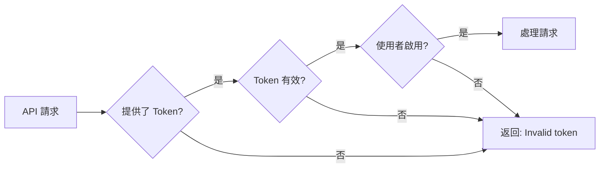

# 身份驗證

WNCMS API 使用可配置的身份驗證方法來保護 API 端點。本指南說明如何驗證您的 API 請求。

## 身份驗證方法

WNCMS 支援可按端點配置的多種身份驗證模式：

| 模式     | 說明               | 使用情境         |
| -------- | ------------------ | ---------------- |
| **無**   | 不需要身份驗證     | 公開端點         |
| **簡易** | API token 身份驗證 | 最常見，建議使用 |
| **基本** | HTTP 基本身份驗證  | 舊系統           |

## 白名單閘道

**系統設定 -> API** 中的 `api_access_whitelist` 是 API 請求的全域附加檢查。

- 留空時不啟用白名單檢查。
- 每行填寫一個 IP 或網域，只有符合的請求才會繼續執行端點驗證。
- IP 比對使用請求 IP。
- 網域比對使用請求 `Origin` 標頭，缺少時回退到 `Referer`。

範例：

```text
111.222.333.444
example.com
example2.com
222.333.444.555
```

## Backend API v2 Bearer Token

Backend API v2 路由使用以下端點簽發的 access token：

```text
POST /api/v2/backend/auth/login
```

將回傳的 token 放入 bearer header：

```bash
curl "https://your-domain.com/api/v2/backend/links?website_id=1" \
  -H "Authorization: Bearer YOUR_TOKEN" \
  -H "Accept: application/json"
```

### Refresh 傳輸模式

`api_refresh_transport` 選擇一個互斥的 refresh 通道：

- `json`（預設）：登入和 refresh 回傳 `refresh_token`；refresh 與 logout
  只接受 JSON body 中的 token。WNCMS 不讀取或寫入 refresh/CSRF cookie。
- `cookie`：登入和 refresh 絕不回傳 refresh 明文。WNCMS 使用 Secure、
  HttpOnly 的 `__Secure-wncms_refresh` cookie，以及可讀取的 Secure
  `wncms_refresh_csrf` cookie。兩者的 path 均為
  `/api/v2/backend/auth`，預設為 host-only domain，並使用已驗證的
  `SameSite` 策略。

Cookie 模式的登入、refresh 與 logout 要求完全符合的允許 `Origin`，比較
scheme、host 與有效 port。缺少、`null`、wildcard、格式錯誤或未獲准的值
都會被拒絕。只有明確啟用 `api_refresh_cookie_referer_fallback` 且沒有
`Origin` 時，系統才會考慮 `Referer`。

Cookie refresh 與 logout 必須將 `wncms_refresh_csrf` 複製到
`X-WNCMS-CSRF` 標頭。WNCMS 會比較兩者，並驗證它們與目前 session 的
精確 refresh credential 之間的 hash-only 綁定。帶原始 proof 的重播可進入
reuse 偵測，隨機或過時 proof 仍會被拒絕。為相容 SQL Server，JSON mode 的
session 與 refresh credential 允許 nullable proof 且不建立 database unique
index；Cookie proof 仍使用不可猜測的隨機值、只儲存 hash 並以 `hash_equals`
比較。成功 refresh 會輪換兩個 cookie；logout 和適用的 session
撤銷會讓兩個 cookie 過期。Body/cookie 通道不一致回傳
`authentication.refresh_transport_mismatch`，Origin 與 CSRF 失敗分別回傳
`authentication.origin_denied` 和 `authentication.csrf_failed`；兩者都會寫入
已去識別化的 security event。

Host 必須為完全符合的設定 Origins 與 `api/v2/backend/auth/*` path 啟用
credentialed CORS；credentials 不可搭配 `*` Origin。WNCMS 會加入精確的
`Access-Control-Allow-Origin`、`Access-Control-Allow-Credentials: true` 與
`Vary: Origin`，並處理 auth preflight。除非應用 URL/cookie 均為 HTTPS，且
host CORS 設定 `supports_credentials = true`、涵蓋 auth path 與所有精確
Origins，否則 `SameSite=None` 會被拒絕。Host `allowed_origins` 不可包含
`*`，`allowed_origins_patterns` 必須為空；精確值與 wildcard 混用會 fail
closed。被拒絕的 actual 與 preflight 請求絕不會反射 CORS 許可標頭。永久 remember credential 的瀏覽器
cookie 仍採用有界的 400 天持久期限，logout 始終依完全相同 scope 清除。涵蓋範圍包含
`auth/me` 在內的所有 auth routes，並支援 Laravel 風格的前後 slash 與
host-keyed `cors.paths`，以及 Laravel `fullUrlIs()` URL pattern。精確 path 項目
採用 Laravel 不受 query 影響的 `path()` 語意，但精確 full URL 無法證明涵蓋
任意 query variant；full-URL 涵蓋因此必須使用 path wildcard，例如
`https://api.example.test/api/v2/backend/auth/*`。參數化 session
刪除 route 必須由 auth-wide wildcard 或明確的 `auth/sessions/*` wildcard 涵蓋；
單一範例 session ID 的精確 path 不能證明已涵蓋整個 route。

切換 refresh transport 會撤銷所有 active interactive sessions；變更 Cookie
domain、SameSite、允許 Origins 或 Referer fallback 會撤銷 active Cookie
sessions。Setting 寫入、credential 撤銷與必要的
`security.auth_policy.changed` event 會原子提交；service tokens 不受影響。

Origin 與 CSRF denial 會保留有限的 HMAC sample，並依 event type 與 UTC hour
將所有 attacker tuples 聚合為一列；重複 denial 只增加 aggregate，不會為每個
request 新增 row 或 info log。Event persistence 不可用時，已去識別化 warning
fallback 會同時依 tuple 與全域限流；database、cache 與 logger 故障都不會改變
403。必要的 success event notification 與 structured success log 只會在 event
model 實際 database connection 的最外層 transaction commit 後發出；outer
rollback 不會發出任何一項。Commit 後的 listener 或 logging 故障會被隔離，不能
讓已提交 request 失敗。
若 host 覆寫 `api_security_event` model，該覆寫必須繼承
`ApiSecurityEvent`、保留 `api_security_event` model key，並可擁有自訂預設
connection 與 table。除非明確傳入 connection，否則 persistence、aggregation
與 post-commit notification 都使用該 model 自有的 storage。Aggregate 更新透過
`aggregate_key` 定位，不要求主鍵名稱為 `id`。必要的稽核異動有更嚴格的要求：
操作涉及的 setting、session、access-token 與 refresh-token model 必須與
security-event model 解析到完全相同的命名 connection。WNCMS 會在呼叫異動前
完成此預檢，任何不一致都會回傳 audit-unavailable（API 為 `503`）；系統絕不會
假設跨資料庫原子性。

```javascript
const csrf = readCookie('wncms_refresh_csrf')

await fetch('https://api.example.test/api/v2/backend/auth/refresh', {
  method: 'POST',
  credentials: 'include',
  headers: {
    'Content-Type': 'application/json',
    'X-WNCMS-CSRF': csrf,
  },
  body: '{}',
})
```

對於受保護的 Links mutation，此 token 關聯的使用者始終是 automation actor。
系統會針對該使用者檢查 `link_index`、`link_create`、`link_edit` 或
`link_delete`，強制寫入也會把使用者 ID 記錄在 `mutation_audits`。
Token 不會繞過網站範圍。

### Step-up proof 與高風險 action plan

正式 v2 operation 的 security risk 獨立於資料 mutation risk。Effective risk
取 operation 宣告、normalized input 與目前 environment 的最高值。永久
credential 為 critical；跨站或 broad/full-admin grant 至少為 high。

Credential 與 security operation 使用
`POST /api/v2/backend/auth/reauthenticate`。它接受目前密碼、正式 operation ID
及該 operation 宣告的一個 purpose。只有 interactive session 能取得五分鐘
proof。將 proof 一次性放入 `X-WNCMS-Step-Up`；WNCMS 只儲存 hash，並綁定 actor、
精確 session、purpose、expiry，以及之後發生的密碼或 session security event，
包括完成密碼重設。密碼檢查失敗會記錄 audit，並按 account 與 IP 獨立限流。若
operation 宣告多個 purpose，執行時須以 `X-WNCMS-Step-Up-Purpose` 指定其中一個。

當 `api_high_risk_action_mode=planned` 時，符合資格的 high 與 critical
operation 先以 `operation`、原始 `input` 及識別目標所需的 route `parameters`
呼叫 `POST /api/v2/backend/action-plans`。client 不可提交 target fingerprint 或
environment assertion；WNCMS 會依 operation schema 套用 type/default，並在 server
解析目前 target fingerprint 與 environment。回應包含 opaque plan ID 與只顯示一次的
confirmation；五分鐘內將 confirmation 放入 `X-WNCMS-Confirmation`。它以原子
方式 single-use，並綁定 actor、credential public ID、適用的 interactive
session、operation、input、target state、website scope、ability/permission
結果與 effective risk。缺少 proof 或 plan 回傳 `428`；expired、stale 或 reused
plan 回傳穩定 `409`。正式 credential types 與一般 guard 允許時，service token 可
執行非 credential 的 high/critical operation；legacy credential 不可執行 critical
operation。Domain/outbox mutation、proof/plan 消耗與 mandatory audit 必須在同一 named
database connection 原子提交。Async 只支援同 database 的 transactional outbox；直接
network 或外部 queue enqueue 會在執行前 fail closed。Idempotent retry 會在重新檢查已
消耗 confirmation 前 replay 已提交結果。

Production legacy operation 使用明確的 security descriptor；WNCMS 不會從 HTTP
method 或 operation name 推斷安全性。每條 configured route 都必須宣告 credential
types、step-up 與 plan policy、domain/outbox model boundary、side-effect kind、request
canonicalizer、target resolver 及 idempotency；宣告缺失或含糊時會 fail closed。目前
planned execution 只開放給 model 與 plan 使用相同 database connection 的 generic
resource mutation。Custom controller、dynamic-model operation、Spatie role/permission
mutation 及 external side effect 在提供同等 atomic boundary 前均不開放 planned
execution。

Plan 建立與執行使用相同的 server-owned canonicalizer。執行時 WNCMS 會開啟 named
transaction，重新鎖定並解析 target rows，然後重新取樣目前 environment，再比較 plan
binding。Bulk binding 同時包含排序後的 requested IDs 與 locked rows，因此新增、刪除或
原先缺失的 target 都會使 plan stale。Account 與 IP reauthentication limit 會在 token
authentication 後執行，讓 account limit 綁定到實際 actor。

Generic resource descriptor 也會綁定所選 website rows，以及 target model 實際的
`websites` pivot membership。每個 `website_id` 與 `website_ids` 值都必須同時位於
credential scope 與 actor 目前可存取範圍內。Website resource 的 route 或 bulk target
ID 本身就是 authoritative website scope，即使 Website model 在其他語意上是 global。
Website-scoped create 要求非空 binding；update 在省略所有 website selector 時保留目前
pivot membership。提供 selector 時，`website_key` 會解析為 canonical ID；明確的空值、
`null`、空字串，以及 `website_id`、`website_ids`、`website_key` 之間的衝突都會被拒絕。
Plan 與 mutation 使用同一個 canonical binding。沒有 membership 的
website-scoped target 會被拒絕。執行 transaction 內會重新鎖定並檢查 fresh actor row、
actor-to-website membership、website ownership、target rows、website rows 與 pivots。
Actor 失去目前存取權時會在執行前被拒絕；planned target state 缺失會使 plan stale，
direct execution 則 fail closed。Target、actor、website、pivot、plan、proof 與
security-event model 必須解析到同一個 named database connection，否則 plan 建立或
執行會在 side effect 前 fail closed。Global model 在明確選擇的 website 通過一般 scope
授權後，仍保留 global target semantics。

Action plan 建立會先按 target operation 檢查 accepted credential type、ability、目前
permission、website scope 與 actor 目前存取權。Credential、ability 與 authoritative
direct/role permission snapshot 會在 target 或 website resolution 前檢查，避免未授權 caller
由後續錯誤推斷 target 是否存在。Permission model 及 direct、role、role-permission pivot
必須使用同一個 named connection。系統在同一個 named transaction 內鎖定並
解析 authorization/target snapshot，然後原子寫入 hash-only plan 與 mandatory
`risk.plan.created` event。未授權請求不會建立任何資料列；audit 失敗會回滾 plan，也不會
回傳 plaintext confirmation。
公開的 `ActionPlanService` 建立方法同樣強制此邊界，direct package caller 無法繞過授權或
mandatory audit。Bulk operation 在 direct execution 與 plan 建立時要求所有 requested target
存在；有效 plan 建立後 target 消失則回傳 `risk.plan_stale`。

啟用 Spatie 萬用字元權限時，鎖定的授權快照會對剛從資料庫讀取的直接與角色授權套用已設定的萬用字元實作，不會使用權限註冊器的陳舊快取，並保留 guard 與 team 範圍語意。關閉萬用字元支援時，精確權限行為維持不變。

單站模型只接受一個規範化的 `website_id`、`website_key`，或只含一項的 `website_ids`。提供多個不同網站會回傳 `422 validation.failed`；WNCMS 不會靜默選取第一個值。計畫建立、直接執行與資源控制器使用同一模型網站模式和規範綁定。

執行會在任何副作用前，以交易內重新讀取的目標與環境快照重算有效風險，再重新套用計畫資格、憑證、step-up 與高風險模式規則。因此 normal→high 的即時升級在沒有確認碼時回傳 `428 risk.plan_required`，操作不具計畫資格時回傳 `503 risk.policy_unavailable`，而已提供計畫與新風險或環境綁定不符時回傳 `409 risk.plan_stale`。直接模式仍會執行其憑證限制。

計畫過時或確認碼重複使用時，會先回滾完整領域交易，再於相同具名連線的獨立交易中準確寫入一筆必要的 `risk.plan.stale` 或 `risk.confirmation.reused` 事件，並包含穩定錯誤代碼與 HTTP 狀態。若拒絕稽核無法提交，最終回應為 `503 security.audit_unavailable`；領域變更與確認狀態均保持不變。

Descriptor 的 `ability` 與 data `risk` 是語意宣告，不會從 HTTP method 推導。Registry
啟動時會拒絕 resource/bridge operation-ID collision，除非 ID 位於經審核的 override
清單。Direct mode 可執行已授權的 external bridge，但沒有 transactional plan guarantee；
planned mode 下不符合 plan 資格的 high/critical bridge 會回傳
`risk.policy_unavailable`。Reauthentication 達到 account 或 IP limit 時，`429` denial
會以 rate-limited context 記錄為 `auth.step_up.failed`；mandatory audit 無法持久化時，
WNCMS 回傳 `503`。

## 簡易驗證（建議）

使用 API token 的最常見身份驗證方法。

### 產生 API Token

1. 登入您的 WNCMS 管理後台
2. 導覽至您的使用者個人資料
3. 找到「API Token」區塊
4. 點擊「產生 Token」或複製現有 token
5. 安全地儲存 token

### 使用 API Token

在請求主體中包含您的 API token：

```json
{
  "api_token": "your-api-token-here",
  "other_parameters": "..."
}
```

### 請求範例

```bash
curl -X POST "https://your-domain.com/api/v1/posts" \
  -H "Content-Type: application/json" \
  -d '{
    "api_token": "abc123def456ghi789jkl012mno345pqr678stu",
    "page_size": 10
  }'
```

### JavaScript 範例

```javascript
const response = await fetch('https://your-domain.com/api/v1/posts', {
  method: 'POST',
  headers: {
    'Content-Type': 'application/json',
  },
  body: JSON.stringify({
    api_token: 'your-api-token-here',
    page_size: 10,
  }),
})

const result = await response.json()
```

## Basic 驗證

Basic 模式使用標準 HTTP `Authorization: Basic ...` 標頭，格式為 `email:password`。

### 請求範例

```bash
curl -X GET "https://your-domain.com/api/v1/posts" \
  -H "Authorization: Basic $(printf '%s' 'user@example.com:your-password' | base64)"
```

如果該端點同時設定了白名單，請求必須先通過白名單檢查，才會驗證 Basic 憑證。

## Token 安全性

:::warning 安全性最佳實務

- **切勿**將 token 提交至版本控制
- **切勿**在客戶端 JavaScript 中公開 token
- **始終**使用 HTTPS 來保護傳輸中的 token
- **定期**輪換 token
- 如果 token **洩露**，立即撤銷
  :::

### 環境變數

將 token 儲存在環境變數中：

#### Node.js (.env)

```bash
WNCMS_API_TOKEN=your-api-token-here
WNCMS_API_URL=https://your-domain.com
```

```javascript
const apiToken = process.env.WNCMS_API_TOKEN
const apiUrl = process.env.WNCMS_API_URL
```

#### PHP (.env)

```bash
WNCMS_API_TOKEN=your-api-token-here
```

```php
$apiToken = env('WNCMS_API_TOKEN');
```

#### Python (.env)

```python
import os
from dotenv import load_dotenv

load_dotenv()
api_token = os.getenv('WNCMS_API_TOKEN')
```

### Token 儲存最佳實務

1. **僅限伺服器端**：將 token 保存在伺服器上，而不是在瀏覽器中
2. **加密儲存**：對資料庫儲存使用加密
3. **有限範圍**：為不同應用程式建立獨立的 token
4. **有效期限**：實作 token 過期策略
5. **稽核日誌**：追蹤 token 使用情況和可疑活動

## 身份驗證流程

### 1. Token 驗證

當收到請求時：


```mermaid
graph LR
    A[API 請求] --> B{提供了 Token?}
    B -->|是| C{Token 有效?}
    B -->|否| D[返回: Invalid token]
    C -->|是| E{使用者啟用?}
    C -->|否| D
    E -->|是| F[處理請求]
    E -->|否| D
```

### 2. 使用者身份驗證

API 自動驗證與 token 關聯的使用者：

```php
// 在後台
$user = User::where('api_token', $request->api_token)->first();

if ($user) {
    auth()->login($user);
    // 使用者現在已驗證
}
```

## 每個端點的配置

每個端點可以透過 WNCMS 全域設定配置自己的身份驗證設定。

### 功能開關

端點可以啟用/停用：

```php
// 設定範例
'wncms_api_posts_index' => true,      // 已啟用
'wncms_api_posts_store' => true,      // 已啟用
'wncms_api_posts_delete' => false,    // 已停用
```

### 身份驗證要求

某些端點可能需要特定權限：

```php
// 僅限管理員端點範例
if (!$user->hasRole('admin')) {
    return response()->json([
        'status' => 'fail',
        'message' => 'Admin access required'
    ], 403);
}
```

## 常見身份驗證場景

### 場景 1：公開讀取，需驗證寫入

```javascript
// 讀取文章 - 不需身份驗證（如果已配置）
const posts = await fetch('/api/v1/posts', {
  method: 'GET',
})

// 建立文章 - 需要身份驗證
const newPost = await fetch('/api/v1/posts/store', {
  method: 'POST',
  body: JSON.stringify({
    api_token: 'your-token',
    title: 'New Post',
    content: 'Content here',
  }),
})
```

### 場景 2：不同應用程式使用不同 Token

```javascript
// 行動應用程式 token
const mobileToken = process.env.MOBILE_API_TOKEN

// 網頁應用程式 token
const webToken = process.env.WEB_API_TOKEN

// 管理儀表板 token
const adminToken = process.env.ADMIN_API_TOKEN
```

### 場景 3：Token 輪換

```javascript
async function rotateToken(currentToken) {
  // 1. 透過管理後台產生新 token
  const newToken = await generateNewToken()

  // 2. 更新環境變數
  process.env.WNCMS_API_TOKEN = newToken

  // 3. 撤銷舊 token
  await revokeToken(currentToken)

  return newToken
}
```

## 錯誤回應

### 無效 Token

```json
{
  "status": "fail",
  "message": "Invalid token"
}
```

**原因：**

- Token 不正確
- Token 已被撤銷
- 使用者帳戶已停用

**解決方案：**

1. 驗證 token 是否正確
2. 從管理後台重新產生 token
3. 檢查使用者帳戶狀態

### API 已停用

```json
{
  "status": 403,
  "message": "API access is disabled"
}
```

**原因：**

- 設定中已停用 API 端點
- 全域 API 存取已關閉

**解決方案：**

1. 在 WNCMS 設定中啟用特定端點
2. 聯繫系統管理員
3. 檢查全域 API 配置

### 需要管理員權限

```json
{
  "status": "fail",
  "message": "Admin access required"
}
```

**原因：**

- 端點需要管理員角色
- 目前使用者不是管理員

**解決方案：**

1. 使用管理員使用者的 API token
2. 向管理員請求管理員權限

## 多使用者場景

### 多個使用者

每個使用者應該有自己的 API token：

```javascript
// 使用者 1 的 token
const user1Token = 'token_for_user_1'

// 使用者 2 的 token
const user2Token = 'token_for_user_2'

// 根據情境使用適當的 token
const token = currentUserId === 1 ? user1Token : user2Token
```

### 服務帳戶

為 API 整合建立專用使用者：

1. 在 WNCMS 中建立新使用者帳戶
2. 指派適當角色（例如「API 使用者」）
3. 為此使用者產生 API token
4. 將此 token 用於您的整合

**優點：**

- 更好的稽核軌跡
- 可以在不影響其他使用者的情況下撤銷存取權限
- 指派特定權限

## 測試身份驗證

### 測試 Token 有效性

```javascript
async function testToken(apiToken) {
  try {
    const response = await fetch('https://your-domain.com/api/v1/posts', {
      method: 'POST',
      headers: {
        'Content-Type': 'application/json',
      },
      body: JSON.stringify({
        api_token: apiToken,
        page_size: 1,
      }),
    })

    const result = await response.json()

    if (result.status === 'success') {
      console.log('✓ Token is valid')
      return true
    } else if (result.message === 'Invalid token') {
      console.log('✗ Token is invalid')
      return false
    } else {
      console.log('⚠ Token valid but endpoint disabled')
      return true // Token 有效，只是端點已停用
    }
  } catch (error) {
    console.error('Network error:', error)
    return false
  }
}

// 使用方式
const isValid = await testToken('your-api-token')
```

### 自動化 Token 驗證

```javascript
class TokenValidator {
  constructor(apiUrl, apiToken) {
    this.apiUrl = apiUrl
    this.apiToken = apiToken
    this.isValid = null
    this.lastChecked = null
  }

  async validate() {
    const response = await fetch(`${this.apiUrl}/api/v1/posts`, {
      method: 'POST',
      headers: {
        'Content-Type': 'application/json',
      },
      body: JSON.stringify({
        api_token: this.apiToken,
        page_size: 1,
      }),
    })

    const result = await response.json()
    this.isValid = result.status === 'success' || result.status !== 'fail'
    this.lastChecked = new Date()

    return this.isValid
  }

  async ensureValid() {
    // 每小時檢查一次
    if (!this.lastChecked || Date.now() - this.lastChecked > 3600000) {
      await this.validate()
    }

    if (!this.isValid) {
      throw new Error('API token is invalid')
    }

    return true
  }
}

// 使用方式
const validator = new TokenValidator('https://your-domain.com', 'your-api-token')

await validator.ensureValid() // 在繼續之前驗證
```

## 最佳實務

### 1. 始終使用 HTTPS

```javascript
// ✓ 正確
const apiUrl = 'https://your-domain.com/api/v1/posts'

// ✗ 錯誤 - 暴露 token
const apiUrl = 'http://your-domain.com/api/v1/posts'
```

### 2. 不要記錄 Token

```javascript
// ✓ 正確
console.log('Making API request')

// ✗ 錯誤 - 記錄敏感資料
console.log('Token:', apiToken)
```

### 3. 在標頭中處理 Token（伺服器端）

對於伺服器端應用程式，您可以實作自定義中介軟體來接受標頭中的 token：

```javascript
// 自定義實作（非內建）
const response = await fetch(url, {
  headers: {
    Authorization: `Bearer ${apiToken}`,
  },
})
```

### 4. 實作 Token 更新

```javascript
class ApiClient {
  constructor() {
    this.token = process.env.API_TOKEN
    this.tokenExpiry = null
  }

  async refreshToken() {
    // 實作您的 token 更新邏輯
    // 這是特定於應用程式的
    this.token = await getNewToken()
    this.tokenExpiry = Date.now() + 24 * 60 * 60 * 1000 // 24 小時
  }

  async request(endpoint, data) {
    if (this.tokenExpiry && Date.now() > this.tokenExpiry) {
      await this.refreshToken()
    }

    return fetch(endpoint, {
      method: 'POST',
      body: JSON.stringify({
        api_token: this.token,
        ...data,
      }),
    })
  }
}
```

### 5. 限制請求速率

```javascript
class RateLimitedClient {
  constructor(apiToken, maxRequestsPerMinute = 60) {
    this.apiToken = apiToken
    this.maxRequests = maxRequestsPerMinute
    this.requests = []
  }

  async throttle() {
    const now = Date.now()
    this.requests = this.requests.filter((time) => now - time < 60000)

    if (this.requests.length >= this.maxRequests) {
      const waitTime = 60000 - (now - this.requests[0])
      await new Promise((resolve) => setTimeout(resolve, waitTime))
    }

    this.requests.push(now)
  }

  async request(url, data) {
    await this.throttle()

    return fetch(url, {
      method: 'POST',
      body: JSON.stringify({
        api_token: this.apiToken,
        ...data,
      }),
    })
  }
}
```

## 疑難排解

### 重新產生後 Token 無法使用

**問題：**新 token 返回「Invalid token」

**解決方案：**

1. 清除應用程式快取
2. 等待幾秒鐘以進行傳播
3. 驗證您複製了整個 token
4. 檢查 token 字串中的空格

### 隨機身份驗證失敗

**問題：**Token 有時有效，有時失敗

**解決方案：**

1. 檢查是否有多個伺服器負載平衡
2. 驗證資料庫複製是否正常運作
3. 尋找快取問題
4. 檢查伺服器時間同步

### 無法產生 Token

**問題：**「產生 Token」按鈕無法使用

**解決方案：**

1. 檢查使用者權限
2. 驗證管理後台存取權限
3. 檢查瀏覽器控制台是否有 JavaScript 錯誤
4. 聯繫系統管理員

## 相關文件

- [入門指南](./getting-started.md) - 使用身份驗證的第一個 API 呼叫
- [核心概念](./core-concepts.md) - 了解 API 回應
- [錯誤參考](./errors.md) - 身份驗證錯誤代碼
- [疑難排解](./troubleshooting.md) - 常見身份驗證問題

## 安全檢查清單

在部署到正式環境之前：

- [ ] API token 儲存在環境變數中
- [ ] 所有 API 呼叫使用 HTTPS
- [ ] Token 未在客戶端程式碼中公開
- [ ] Token 未被記錄或顯示
- [ ] 已制定 token 輪換策略
- [ ] 已實作速率限制
- [ ] 錯誤訊息不暴露敏感資料
- [ ] 為不同環境使用獨立的 token
- [ ] 已記錄 token 撤銷程序
- [ ] 已啟用稽核日誌記錄
